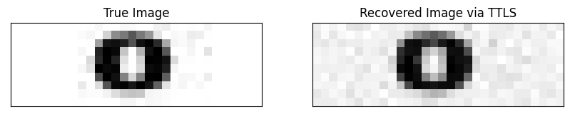
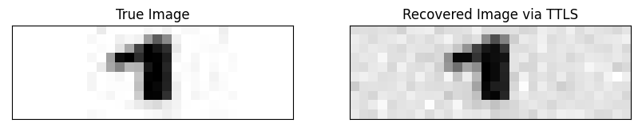
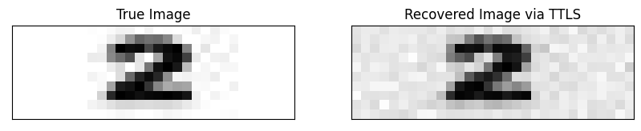

# Phase Retrieval via Tensor Total Least Squares

Provable Low Rank Phase Retrieval (TTLS) implementation for solving complex-valued signal matrices. This implementation is based on the paper "PHASE RETRIEVAL BY TENSOR TOTAL LEAST SQUARES". 

Paper source： To do

## Programs

* tls_utils.py--Implementation of TTLS
* demo.ipynb--TTLS recovery demo on real data

## Tutorial

This tutorial can be found in demo.ipynb

## Recovery Example

